# Hypatia Agent System Flowcharts

## Agent Count Summary
**Total: 11 Agents**
- 3 Main Agents
- 1 Utility Agent
- 3 Debate Sub-Agents
- 2 Debate Orchestrators
- 2 Manager/Coordination Agents

---

## 1. PeopleFinderAgent

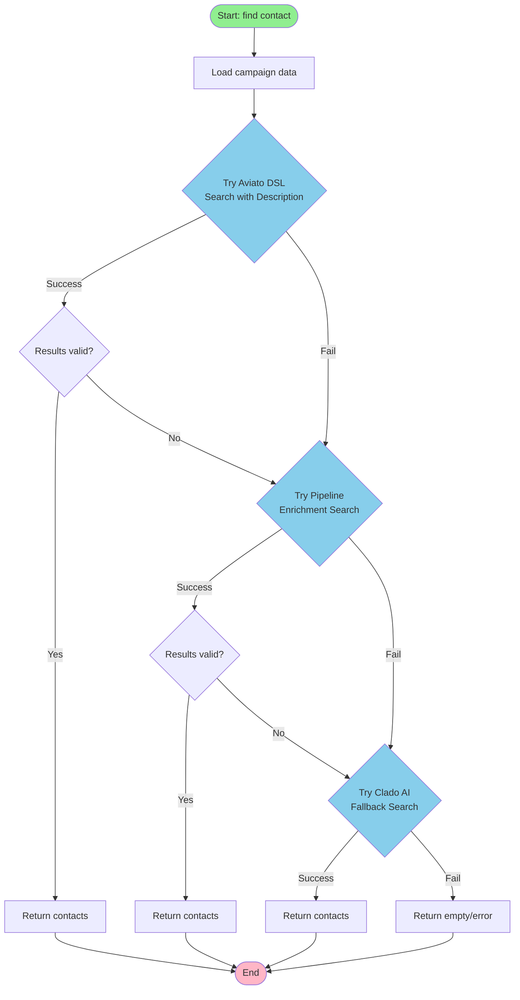

**Purpose:** Three-tier fallback system to find contacts
**Strategy:** Aviato DSL → Pipeline Enrichment → Clado AI

---

## 2. WriterAgent

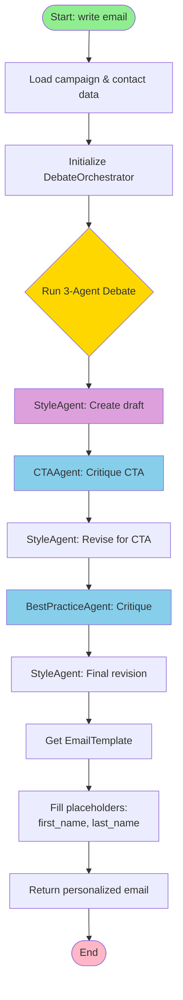

**Purpose:** Uses internal debate system to write personalized emails
**Key Feature:** Collaborative 3-agent debate (Style, CTA, BestPractice)

---

## 3. FollowupAgent

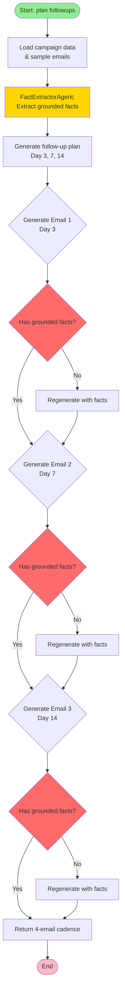

**Purpose:** Creates 3-email follow-up sequences (Days 3, 7, 14)
**Key Feature:** Grounded fact extraction prevents hallucination

---

## 4. FactExtractorAgent

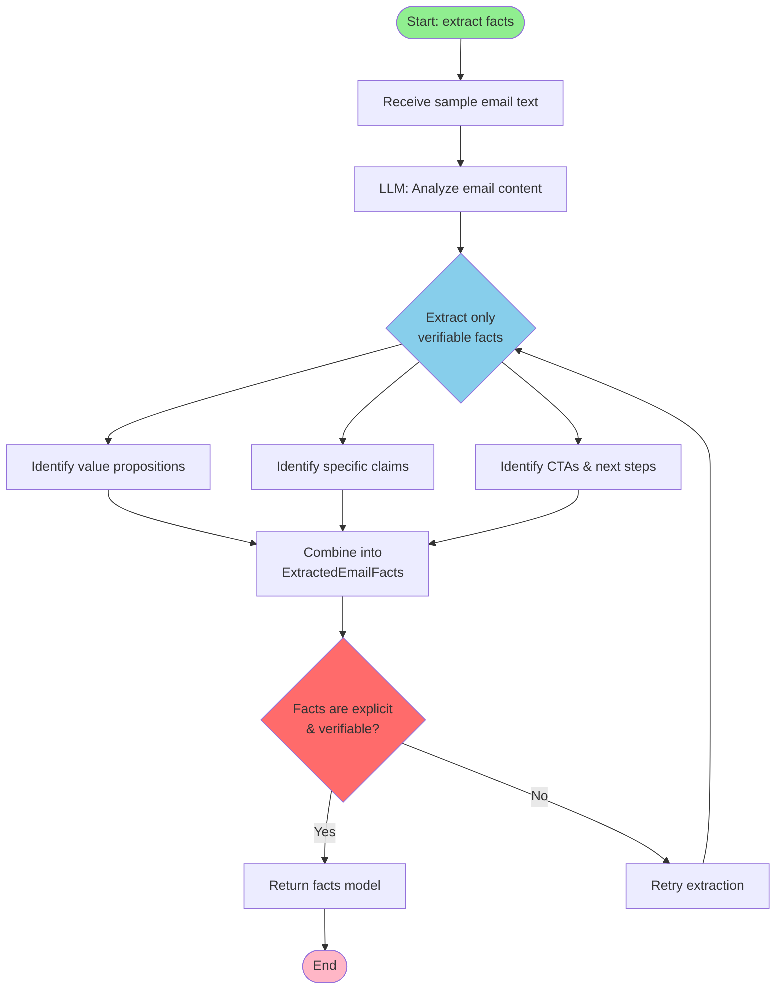

**Purpose:** Extracts verifiable facts from sample emails
**Output:** Structured model with value props, claims, CTAs

---

## 5. StyleDebateAgent

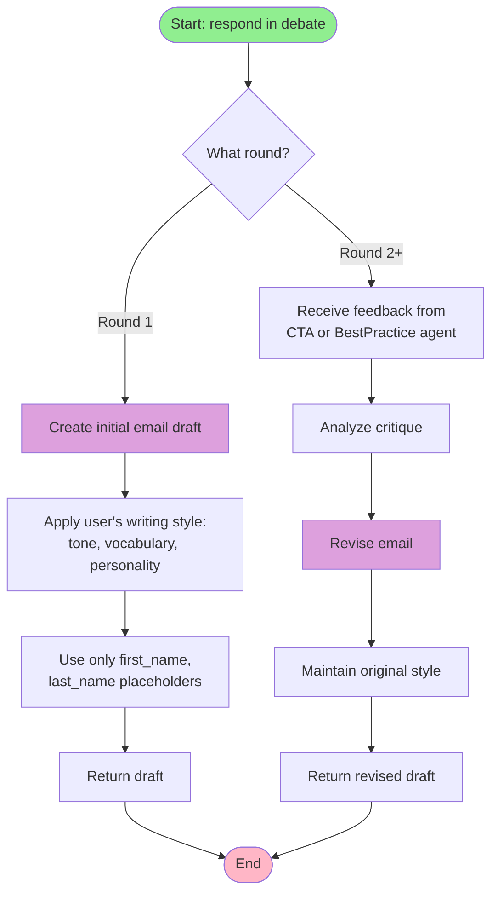

**Role:** Drafts and revises emails matching user's style
**Constraint:** Only uses {first_name} and {last_name} placeholders

---

## 6. CTADebateAgent

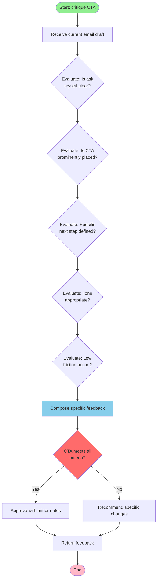

**Role:** Ensures call-to-action is clear and compelling
**Criteria:** Clarity, placement, specificity, tone, friction

---

## 7. BestPracticeDebateAgent

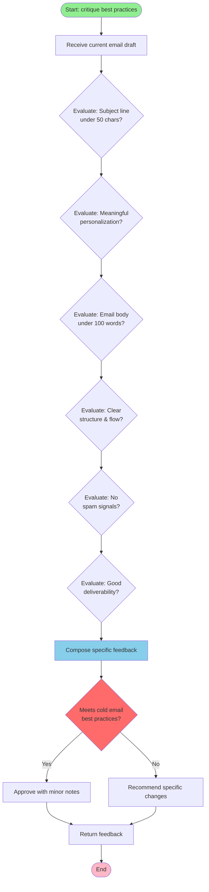

**Role:** Applies cold email best practices
**Areas:** Subject line, personalization, length, structure, spam, deliverability

---

## 8. DebateOrchestrator

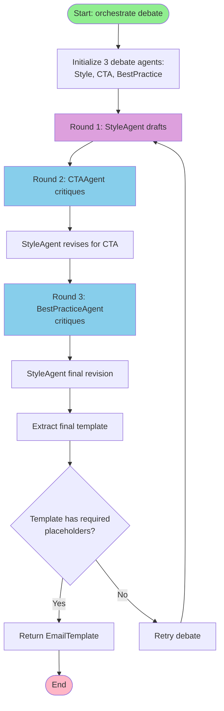

**Purpose:** Orchestrates round-robin debate between 3 agents
**Flow:** Style drafts → CTA critiques → Style revises → BP critiques → Style revises

---

## 9. LangGraphDebateOrchestrator

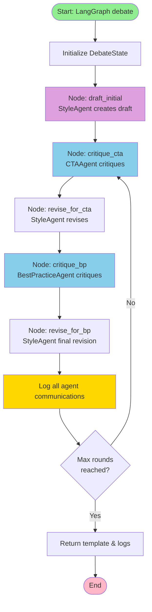

**Purpose:** LangGraph-based debate with explicit state management
**Features:** Graph workflow, communication logging, conditional looping

---

## 10. ManagerAgent

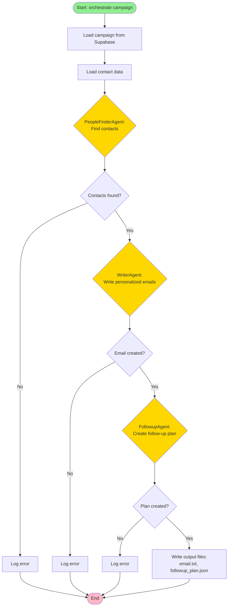

**Purpose:** Orchestrates 3 main agents using real campaign data
**Flow:** Load data → Find people → Write emails → Plan followups → Output files

---

## 11. LangGraphManagerAgent

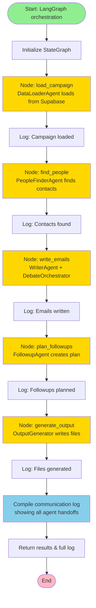

**Purpose:** Multi-agent orchestration using LangGraph with full logging
**Special Feature:** Generates detailed communication log showing agent reasoning

---

## System Architecture Overview

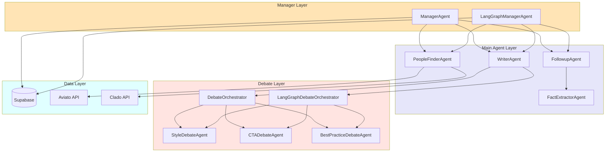

---

## Agent Communication Flow

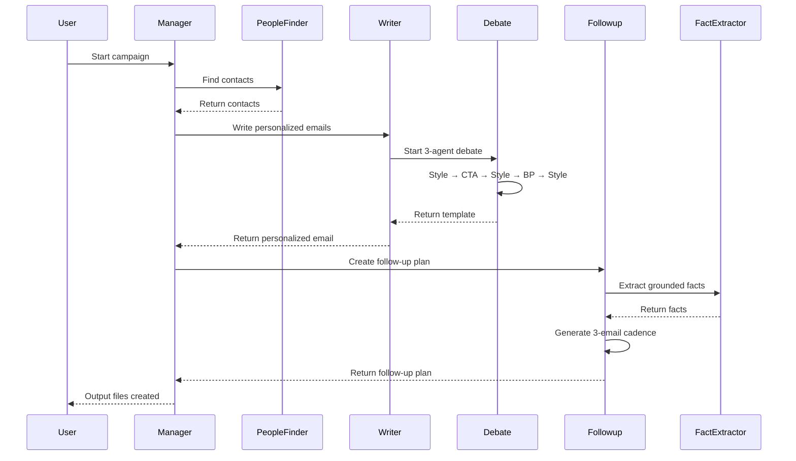

---

## Legend

- 🟢 Green: Start/Entry points
- 🔴 Pink: End/Exit points
- 🔵 Blue: Processing/Evaluation nodes
- 🟡 Yellow: Sub-agent calls
- 🟣 Purple: Content creation
- ⚠️ Red: Validation/Decision points
